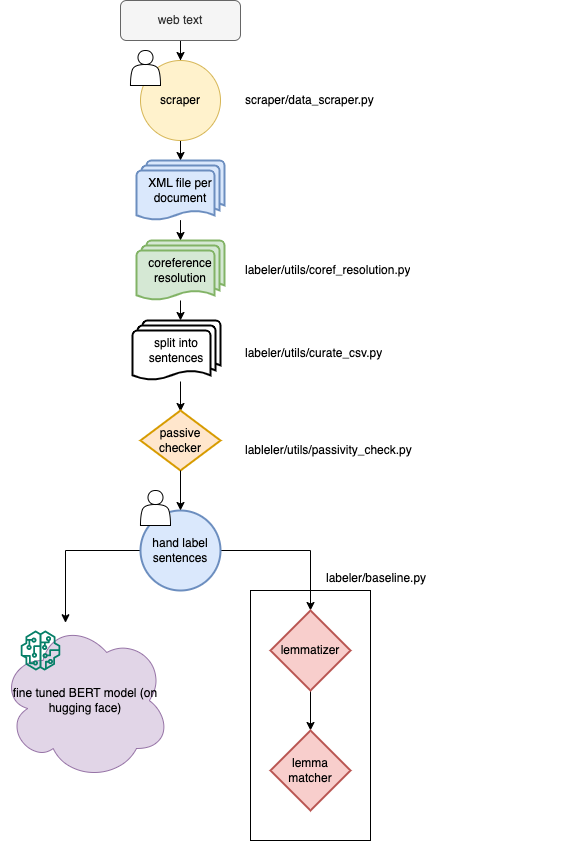

# LLM Anthropomorphization

LING-472 / ANLY-521 Final Project | Georgetown University | Spring 2023

**Developers:**

- [Jess Cusi](https://github.com/jessicacusi) - *jdc286@georgetown.edu*
- [Caroline Gish](https://github.com/cngish98) - *cng38@georgetown.edu*
- [Cindy Li](https://github.com/cjlicjli) - *cl1579@georgetown.edu*

## Background

### [Presentation Slides](https://docs.google.com/presentation/d/1ZHLGu2YBoXJVcdEjcOy1eXtJxd5EY-3f_f3NjuFypEo/edit?usp=sharing)

This project studies the issue of anthropomorphization of large language models and AI by classifiying individual
sentences as either anthropomorphic or not.

There is a rudimentary rule-based baseline model and a fine-tuned BERT-based model. While the code for the model is
included in the package, it is likely you will need additional compute to run the modeling. The colab notebook is
included to run the model in Google Colab. The fine-tuned model is hosted on Hugging Face's website for sentence checking. 

You can download the [llm_anthro_detection model](https://huggingface.co/jc-cl-cg/llm_anthro_detection) from Hugging Face.

## Development

### Set up & Installation

To install required packages:

```commandline
conda env create --name llm --file environment.yml 
```

To add required packages to the environment.yml

```commandline
conda env export > environment.yml --no-builds
```

To install the project:

```
pip install .
```

### Formatting

Code is formatted with `black`.

## Data

For information about the data we used and how to retrieve it yourself, see [scraper](/scraper). The paths provided
assume your data directory is on the same level as LLM-anthropomorphization. If your data is stored elsewhere, make sure
to adjust the path.

## Running the Project

```commandline
cd labeler/bin
python main.py --data <data> --process <baseline,model> --export
```

- [required] `data` is the location of your data files
- [required] `process` indicates whether you want to run the baseline labeler or model labeler. for the model labeler,
  baseline is
  still run fgit irst.
- [optional] `export` will write baseline output to csv

For example, this command runs the baseline labeler against the labeled data in our private repository and will not
write the baseline labeled output to csv.

```commandline
python main.py -d ../../../llm-data/labeled-data/ -p baseline
```

## Architecture


editable link: https://drive.google.com/file/d/1tKZ5nE8fUW5WPYzKtyIoeKjDIkxWm7Mk/view?usp=sharing
